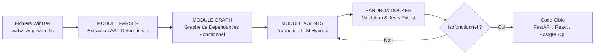

# Tharos Core — Moteur de Migration & Résolution de Dette Technique

Tharos Core est une usine logicielle agentique conçue pour automatiser la modernisation de bases de code legacy WinDev/WLanguage vers des architectures modernes (FastAPI, React, PostgreSQL).

Plutôt que d'effectuer une traduction textuelle aveugle, Tharos extrait l'Arbre de Syntaxe Abstraite (AST), construit un graphe de dépendances fonctionnel et orchestre un pipeline d'agents locaux et distants pour générer un code cible validé par des tests d'équivalence.

## Architecture Globale



## Fonctionnalités

- **Parsing AST Déterministe :** Extraction de la logique métier sans dépendre d'un LLM pour éviter toute hallucination.
- **Pipeline Hybride :** Utilisation de LLM distants pour la traduction haute couche et de LLM de code spécialisés (Qwen2.5-Coder / Mistral / Claude 3.5) pour les boucles de correction à coût optimisé.
- **Sandboxing Docker :** Validation automatique des comportements via l'exécution de tests `pytest` isolés.
- **Mode Offline / On-Premise :** Exécution 100 % locale sur matériel dédié (NVIDIA RTX 5090 / vLLM / Ollama).

## Prérequis

- **Docker & Docker Compose** — pour la sandbox de validation et l'exécution isolée des tests
- **Python 3.12+** — langage principal du projet
- **uv** — gestionnaire de packages rapide (remplace pip/poetry)
- **NVIDIA Container Toolkit** *(optionnel)* — requis uniquement si vous souhaitez faire tourner l'inférence LLM en local sur GPU (RTX 5090)

## Stack Technique

- **Langage :** Python 3.12+
- **Parsing :** Tree-sitter / Parsers AST dédiés
- **Inférence IA :** vLLM, Ollama, API Anthropic/OpenAI
- **Environnement :** Docker / Pytest

## Démarrage Rapide

```bash
# Cloner le dépôt
git clone https://github.com/eberess/tharos_core.git
cd tharos_core

# Installer les dépendances avec uv
uv sync

# Lancer le parsing d'un fichier WinDev
python -m tharos.cli parse --input ./tests/samples/facturation.wdw
```
