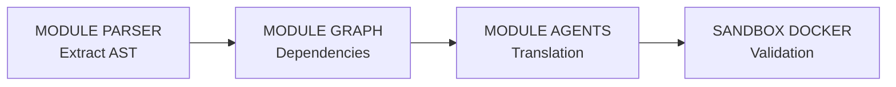

# Cahier des Charges : Tharos Core (v1.0)

## 1. Objectif
Automatiser à 80%+ la migration d'applications propriétaires (Cible P0 : WinDev / WLanguage) vers une pile moderne (Python FastAPI, React, PostgreSQL) avec garantie d'isofonctionnalité.

## 2. Périmètre Technique

### Entrées (Input)
- Fichiers sources WinDev (`.wdw`, `.wdg`, `.wda`).
- Schémas et structures HFSQL (`.fic`).

### Sorties (Output)
- Backend : API REST FastAPI (Clean Architecture).
- Frontend : Composants React / TypeScript (Shadcn/UI).
- Base de données : Scripts SQL / ORM SQLAlchemy.
- Tests : Suites de tests d'intégration `pytest`.

## 3. Architecture Modulaire

1. **Parser AST (`tharos.parsers`) :** Analyse syntaxique déterministe du WLanguage (Extraction des procédures, requêtes HFSQL, événements).
2. **Moteur de Graphe (`tharos.graph`) :** Cartographie des dépendances entre IHM, logique métier et tables.
3. **Orchestrateur d'Agents (`tharos.agents`) :**
   - Agent Traducteur : Génération du code cible Python/React.
   - Agent Correcteur TRM : Analyse des erreurs de la Sandbox et correction en boucle locale.
4. **Sandbox Docker (`tharos.sandbox`) :** Exécution automatisée des tests d'équivalence comportementale.

## 4. Contraintes Non-Fonctionnelles
- **Confidentialité :** Support de l'inférence 100 % locale sur RTX 5090 (32 Go VRAM).
- **Fiabilité :** Zéro composant livré sans tests automatisés au vert.
