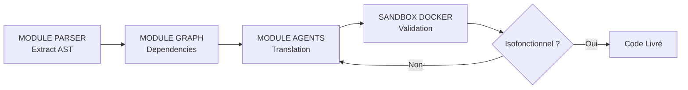

# Cahier des Charges : Tharos Core (v1.0)

## 1. Objectif

Automatiser à 80 %+ la migration d'applications **WinDev / WLanguage** vers une pile moderne (Python FastAPI, React, PostgreSQL) avec garantie d'isofonctionnalité.

> **Scope V1 :** WinDev / WLanguage uniquement. Cobol et autres langages legacy sont exclus de cette version.

## 2. Périmètre Technique

### Entrées (Input)
- Fichiers sources WinDev (`.wdw`, `.wdg`, `.wda`).
- Schémas et structures HFSQL (`.fic`).

### Sorties (Output)
- Backend : API REST FastAPI (Clean Architecture).
- Frontend : Composants React / TypeScript (Shadcn/UI).
- Base de données : Scripts SQL / ORM SQLAlchemy.
- Tests : Suites de tests d'intégration `pytest`.

## 3. Architecture Modulaire

1. **Parser AST (`tharos.parsers`) :** Analyse syntaxique déterministe du WLanguage (extraction des procédures, requêtes HFSQL, événements).
2. **Moteur de Graphe (`tharos.graph`) :** Cartographie des dépendances entre IHM, logique métier et tables.
3. **Orchestrateur d'Agents (`tharos.agents`) :**
   - Agent Traducteur : Génération du code cible Python/React via LLM de code (Qwen2.5-Coder / Mistral / Claude 3.5).
   - Agent Correcteur : Analyse des erreurs de la Sandbox et correction en boucle.
4. **Sandbox Docker (`tharos.sandbox`) :** Exécution automatisée des tests d'équivalence comportementale.

## 4. Critères de Validation & Métriques Cibles

| Critère | Cible |
|---------|-------|
| **Taux d'automatisation** | ≥ 80 % du code généré sans intervention humaine |
| **Isolation** | 100 % du code exécuté et validé sous Sandbox Docker |
| **Isofonctionnalité** | Tests d'équivalence sur les entrées/sorties des procédures, les requêtes HFSQL vs PostgreSQL, et les règles de validation de données |

### Plans de Validation

- **Procédures métier :** Exécution des mêmes jeux de données en entrant/sortant les mêmes résultats attendus.
- **Requêtes HFSQL → PostgreSQL :** Vérification que les requêtes SQL générées produisent les mêmes résultats que les requêtes HFSQL originales.
- **Règles de validation :** Contrôle que les contraintes d'intégrité et de validation des données sont respectées dans le schéma cible.

## 5. Contraintes Non-Fonctionnelles

- **Confidentialité :** Support de l'inférence 100 % locale sur RTX 5090 (32 Go VRAM).
- **Fiabilité :** Zéro composant livré sans tests automatisés au vert.
